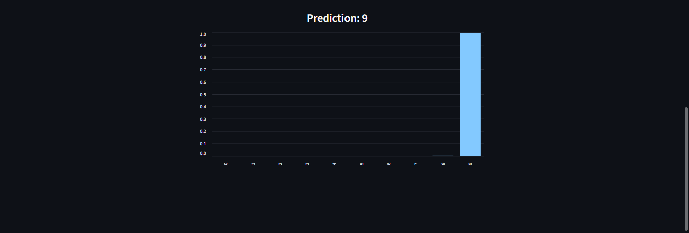

# Handwritten Digit Recognizer (MNIST)

A simple Streamlit app that lets you draw a digit or upload an image of a handwritten one, and then predicts it using a pre-trained Keras MNIST model.

## Features
- Draw a digit directly on the interactive canvas.
- Upload an image of a handwritten digit for prediction.
- Real-time prediction using a pre-trained Keras MNIST model.
- Displays prediction probabilities for all digits in a bar chart.

## Model Structure

This project uses a Convolutional Neural Network (CNN) for handwritten digit recognition. The architecture is as follows:

- **Input:** 28×28 grayscale image  
- **Conv2D layer:** 32 filters, 3×3 kernel, ReLU activation  
- **MaxPooling2D layer:** 2×2 pool size  
- **Conv2D layer:** 64 filters, 3×3 kernel, ReLU activation  
- **MaxPooling2D layer:** 2×2 pool size  
- **Flatten layer:** Converts 2D feature maps into 1D vector  
- **Dense layer:** 128 neurons, ReLU activation  
- **Output Dense layer:** 10 neurons (for digits 0–9), Softmax activation  

**Loss function:** Sparse Categorical Crossentropy  
**Optimizer:** Adam  

## Model Performance

The CNN model was trained on the MNIST dataset and achieved the following results:

- **Test  accuracy:** 98.9%

These results indicate that the model generalizes well on unseen handwritten digit images.

## Demo
Try the app here: [Streamlit App](https://mnist-digit-classifier-6njut6f3ndrmpz2okrigsd.streamlit.app/)

## Installation (Run Locally)
1. Clone the repository
   ```
   git clone https://github.com/Lyra005/MNIST-Digit-Classifier.git
   cd MNIST-Digit-Classifier
   ```
2. Install dependencies
    ```
    pip install -r requirements.txt
    ```
3. Run the app
    ```
    streamlit run app.py
    ```

Streamlit will open a local URL (e.g., `http://localhost:8501`).

## How to use
- Draw mode: Use the canvas to draw a single digit (0–9). The app processes and predicts the digit, and you can optionally show the processed 28×28 image.
- Upload mode: Upload a PNG/JPG/JPEG of a single digit. If the colors are inverted (light background, dark digit), toggle the “Invert uploaded image colors” option for better results.

## Screenshots

**Draw Mode**


**Upload Mode**


**Prediction probabilities**


## Project structure
```
mnist_model/
├─ app.py
├─ model.keras
├─ train_model.ipynb 
├─ requirements.txt
├─ README.md
└─ images/
├─ canvas_view.png
├─ upload_view.png
└─ probabilities_chart.png
```

## Known Issues

- Occasionally, the app may show an error message during use.  
  Refreshing the page usually resolves it.  
  This does not affect predictions or overall functionality.
